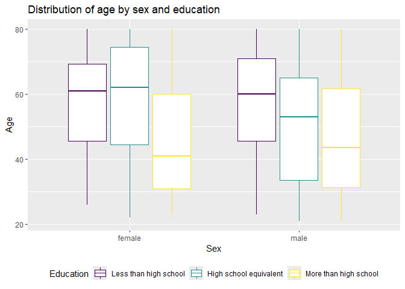
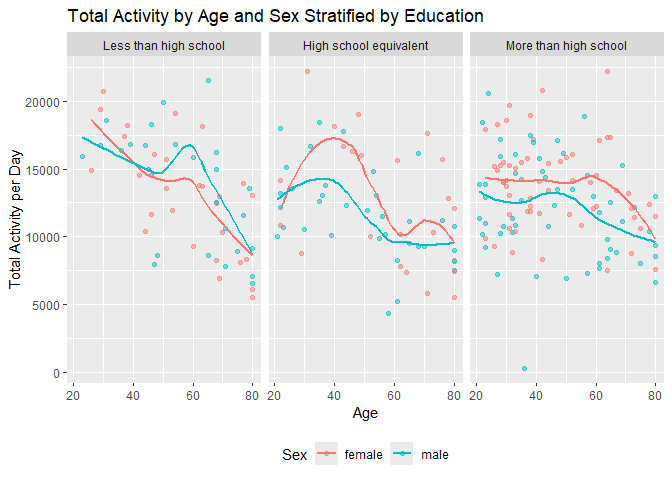

HW3
================

## Problem 2

Load and tidy demographic data. Exclude participants less than 21 years
of age, and those with missing demographic data; and encode data with
reasonable variable classes.

``` r
demo_df = 
  read_csv("data/nhanes_covar.csv", 
    skip = 4,
    na = c("NA", ".", "")) |> 
  janitor::clean_names() |> 
  filter(age >= 21) |> 
  drop_na() |>
  mutate(
    sex = case_match(
      sex,
      1 ~ "male",
      2 ~ "female")) |>
  mutate(
    education = case_match(
      education,
      1 ~ "Less than high school",
      2 ~ "High school equivalent",
      3 ~ "More than high school"
    )) |>
  mutate(education = factor(education, levels = c("Less than high school", "High school equivalent", "More than high school"), ordered = TRUE))
```

    ## Rows: 250 Columns: 5
    ## ── Column specification ────────────────────────────────────────────────────────
    ## Delimiter: ","
    ## dbl (5): SEQN, sex, age, BMI, education
    ## 
    ## ℹ Use `spec()` to retrieve the full column specification for this data.
    ## ℹ Specify the column types or set `show_col_types = FALSE` to quiet this message.

Load and tidy accelerometer data

``` r
accel_df = 
  read_csv("data/nhanes_accel.csv", 
    na = c("NA", ".", "")) |> 
  janitor::clean_names() |> 
  pivot_longer(
    min1:min1440,
    names_to = "minute",
    values_to = "mims",
    names_prefix = "min"
  ) |> 
  mutate(minute = as.numeric(minute))
```

    ## Rows: 250 Columns: 1441
    ## ── Column specification ────────────────────────────────────────────────────────
    ## Delimiter: ","
    ## dbl (1441): SEQN, min1, min2, min3, min4, min5, min6, min7, min8, min9, min1...
    ## 
    ## ℹ Use `spec()` to retrieve the full column specification for this data.
    ## ℹ Specify the column types or set `show_col_types = FALSE` to quiet this message.

Merge demographic and accelerometer data

``` r
merged_df = left_join(demo_df, accel_df)
```

    ## Joining with `by = join_by(seqn)`

Producing a table for the number of men and women in each education
category

``` r
merged_df |> 
  distinct(seqn, .keep_all = TRUE) |> 
  group_by(sex, education) |> 
  summarise(n_obs = n()) |>
  pivot_wider(
    names_from = "sex",
    values_from = "n_obs"
  )|> 
  knitr::kable()
```

    ## `summarise()` has grouped output by 'sex'. You can override using the `.groups`
    ## argument.

| education              | female | male |
|:-----------------------|-------:|-----:|
| Less than high school  |     28 |   27 |
| High school equivalent |     23 |   35 |
| More than high school  |     59 |   56 |

The table shows that while the female and male distribution in the “Less
than high school” and “More than high school” education levels are
similar, there are more males than females in the “High school
equivalent” level.

Creating a visualization of the age distributions for men and women in
each education category. Comment on these items.

``` r
merged_df |> 
  distinct(seqn, .keep_all = TRUE) |> 
  ggplot(aes(x = sex, y= age, color = education))+
  geom_boxplot() +
  theme(legend.position = "bottom") +
  labs(
    title = "Distribution of age by sex and education",
    x = "Sex",
    y = "Age",
    color = "Education"
  )
```

<!-- -->

The boxplot shows that among females, the “More than high school”
education level has significantly a younger age compared to “Less than
high school” and “High school equivalent” education levels. Among males,
the “More than high school” education level also has significantly a
younger age compared to “Less than high school” and “High school
equivalent” education levels. Between the sexes, the average age of
females in the “High school equivalent” education level is higher than
males.

Aggregating across minutes to create a total activity variable for each
participant, then making a plot.

``` r
merged_df |> 
  group_by(seqn, sex, age, education) |> 
  summarise(total_activity = sum(mims)) |> 
  ggplot(aes(x = age, y = total_activity, color = sex)) +
  geom_point(alpha = .5) +
  geom_smooth(se = FALSE) +
  facet_grid(~education) +
  theme(legend.position = "bottom") +
  labs(
      title = "Total Activity by Age and Sex Stratified by Education",
      x = "Age",
      y = "Total Activity per Day",
      color = "Sex"
  )
```

    ## `summarise()` has grouped output by 'seqn', 'sex', 'age'. You can override
    ## using the `.groups` argument.
    ## `geom_smooth()` using method = 'loess' and formula = 'y ~ x'

<!-- -->

Total activity per day decreases with increasing age for all sexes and
education levels. In the “Less than high school” education level, the
total activity per day for males with age greater than 40 is higher than
females. In the “High school equivalent” and “More than high school”
education levels, the females have higher total activity than males.

Making a three-panel plot that shows the 24-hour activity time courses
for each education level and using color to indicate sex.
