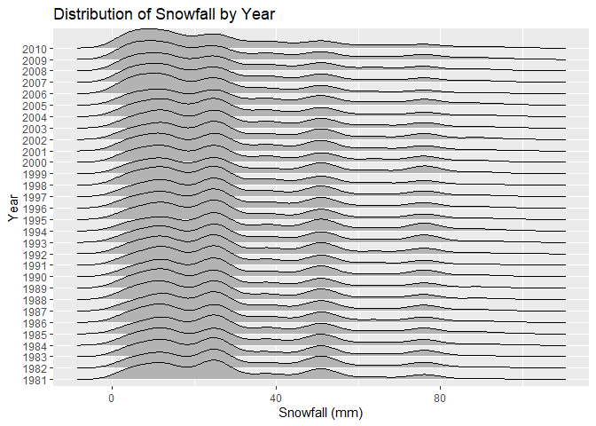

HW3
================

## Problem 1

Load the data

``` r
data("ny_noaa")
```

The “ny_noaa” dataset contains measurements from New York, collected by
National Oceanic and Atmospheric Association (NOAA) of the National
Centers for Environmental Information (NCEI). The dataset contains
2595176 rows and 7 columns. The dataset contains weather station ID,
date of observation, precipitation (tenths of mm), snowfall (mm), snow
depth (mm), maximum and minimum temperatures (tenths of degrees Celsius)

Given that each weather station may collect only a subset of these
variables, and thus the resulting dataset contains extensive missing
data, particularly maximum and minimum temperatures and snowfall and
snow depths, which makes it challenging to analyze this dataset.

Cleaning the data. Creating separate variables for year, month, and
ensuring observations for temperature, precipitation, and snowfall are
given in reasonable units.

``` r
ny_noaa = 
  ny_noaa |> 
  separate(date, into = c("year", "month", "day"), convert = TRUE) |> 
  mutate(
    tmax = as.numeric(tmax),
    tmin = as.numeric(tmin)
  )

ny_noaa |> 
  count(snow) |> 
  arrange(desc(n))
```

    ## # A tibble: 282 × 2
    ##     snow       n
    ##    <int>   <int>
    ##  1     0 2008508
    ##  2    NA  381221
    ##  3    25   31022
    ##  4    13   23095
    ##  5    51   18274
    ##  6    76   10173
    ##  7     8    9962
    ##  8     5    9748
    ##  9    38    9197
    ## 10     3    8790
    ## # ℹ 272 more rows

For snow fall, the most commonly observed value is 0, most likely
because there are more days in the year that does not snow in the New
York than days that snow.

Making a two-panel plot showing the average max temperature in January
and in July in each station across years.

``` r
ny_noaa |> 
  group_by(id, year, month) |>  
  filter(month == c(1, 7)) |> 
  summarize(mean_tmax = mean(tmax, na.rm = TRUE, color = id))  |>  
  ggplot(aes(x = year, y = mean_tmax, group = id)) + 
  geom_point(alpha = .5) + 
  facet_grid(~month) +
  labs(
    title = "Average Temperature Monthly For Each Station Across Years For January and July",
    y = "Average Maximum Temperature (tenths of degrees Celsius)",
    x = "Year"
  )
```

    ## Warning: There were 51334 warnings in `filter()`.
    ## The first warning was:
    ## ℹ In argument: `month == c(1, 7)`.
    ## ℹ In group 2: `id = "US1NYAB0001"`, `year = 2007`, `month = 12`.
    ## Caused by warning in `month == c(1, 7)`:
    ## ! longer object length is not a multiple of shorter object length
    ## ℹ Run `dplyr::last_dplyr_warnings()` to see the 51333 remaining warnings.

    ## `summarise()` has grouped output by 'id', 'year'. You can override using the
    ## `.groups` argument.

    ## Warning: Removed 5972 rows containing missing values or values outside the scale range
    ## (`geom_point()`).

<!-- -->

The average maximum temperature is lower in January than July as
expected. Also as expected, the temperature does not appear to change
across the years in January. Similar trend was seen in July.

There are some outliers. For example, there was one station in around
1983 that had maximum average temperature of more than -15 degrees
celsius in January. In July, there was one station around 1988 that
recorded a maximum average temperature of 15 degrees Celsius.

Making a two-panel plot showing (i) tmax vs tmin for the full dataset,
and (ii) making a plot showing the distribution of snowfall values
greater than 0 and less than 100 separately by year

``` r
ny_noaa |>  
  ggplot(aes(x = tmin, y = tmax)) + 
  geom_hex() +
    labs(
    title = "Maximum Temperature by Minimum Temperature",
    y = "Minimum Temperature (tenths of degrees Celsius)",
    x = "Maximum Temperature (tenths of degrees Celsius)"
  )
```

    ## Warning: Removed 1136276 rows containing non-finite outside the scale range
    ## (`stat_binhex()`).

<!-- -->

``` r
ny_noaa |>  
  filter(snow < 100, snow > 0) |> 
  ggplot(aes(x = snow, y = as.factor(year))) + 
  geom_density_ridges() +
  labs(
    title = "Distribution of Snowfall by Year",
    y = "Year",
    x = "Snowfall (mm)"
  )
```

    ## Picking joint bandwidth of 3.76

<!-- -->

## Problem 2

Load and tidy demographic data. Exclude participants less than 21 years
of age, and those with missing demographic data; and encode data with
reasonable variable classes.

``` r
demo_df = 
  read_csv("data/nhanes_covar.csv", 
    skip = 4,
    na = c("NA", ".", "")) |> 
  janitor::clean_names() |> 
  filter(age >= 21) |> 
  drop_na() |>
  mutate(
    sex = case_match(
      sex,
      1 ~ "male",
      2 ~ "female")) |>
  mutate(
    education = case_match(
      education,
      1 ~ "Less than high school",
      2 ~ "High school equivalent",
      3 ~ "More than high school"
    )) |>
  mutate(education = factor(education, levels = c("Less than high school", "High school equivalent", "More than high school"), ordered = TRUE))
```

    ## Rows: 250 Columns: 5
    ## ── Column specification ────────────────────────────────────────────────────────
    ## Delimiter: ","
    ## dbl (5): SEQN, sex, age, BMI, education
    ## 
    ## ℹ Use `spec()` to retrieve the full column specification for this data.
    ## ℹ Specify the column types or set `show_col_types = FALSE` to quiet this message.

Load and tidy accelerometer data

``` r
accel_df = 
  read_csv("data/nhanes_accel.csv", 
    na = c("NA", ".", "")) |> 
  janitor::clean_names() |> 
  pivot_longer(
    min1:min1440,
    names_to = "minute",
    values_to = "mims",
    names_prefix = "min"
  ) |> 
  mutate(minute = as.numeric(minute))
```

    ## Rows: 250 Columns: 1441
    ## ── Column specification ────────────────────────────────────────────────────────
    ## Delimiter: ","
    ## dbl (1441): SEQN, min1, min2, min3, min4, min5, min6, min7, min8, min9, min1...
    ## 
    ## ℹ Use `spec()` to retrieve the full column specification for this data.
    ## ℹ Specify the column types or set `show_col_types = FALSE` to quiet this message.

Merge demographic and accelerometer data

``` r
merged_df = left_join(demo_df, accel_df)
```

    ## Joining with `by = join_by(seqn)`

Producing a table for the number of men and women in each education
category

``` r
merged_df |> 
  distinct(seqn, .keep_all = TRUE) |> 
  group_by(sex, education) |> 
  summarise(numb_obs = n()) |>
  pivot_wider(
    names_from = "sex",
    values_from = "numb_obs"
  )|> 
  knitr::kable()
```

    ## `summarise()` has grouped output by 'sex'. You can override using the `.groups`
    ## argument.

| education              | female | male |
|:-----------------------|-------:|-----:|
| Less than high school  |     28 |   27 |
| High school equivalent |     23 |   35 |
| More than high school  |     59 |   56 |

The table shows that while the female and male distribution in the “Less
than high school” and “More than high school” education levels are
similar, there are more males than females in the “High school
equivalent” level.

Creating a visualization of the age distributions for men and women in
each education category. Comment on these items.

``` r
merged_df |> 
  distinct(seqn, .keep_all = TRUE) |> 
  ggplot(aes(x = sex, y= age, color = education))+
  geom_boxplot() +
  theme(legend.position = "bottom") +
  labs(
    title = "Distribution of age by sex and education",
    x = "Sex",
    y = "Age",
    color = "Education"
  )
```

<!-- -->

The boxplot shows that among females, the “More than high school”
education level has significantly a younger age compared to “Less than
high school” and “High school equivalent” education levels. Among males,
the “More than high school” education level also has significantly a
younger age compared to “Less than high school” and “High school
equivalent” education levels. Between the sexes, the average age of
females in the “High school equivalent” education level is higher than
males.

Aggregating across minutes to create a total activity variable for each
participant, then making a plot.

``` r
merged_df |> 
  group_by(seqn, sex, age, education) |> 
  summarise(total_activity = sum(mims)) |> 
  ggplot(aes(x = age, y = total_activity, color = sex)) +
  geom_point(alpha = .5) +
  geom_smooth(se = FALSE) +
  facet_grid(~education) +
  theme(legend.position = "bottom") +
  labs(
      title = "Total Activity by Age and Sex Stratified by Education",
      x = "Age",
      y = "Total Activity per Day",
      color = "Sex"
  )
```

    ## `summarise()` has grouped output by 'seqn', 'sex', 'age'. You can override
    ## using the `.groups` argument.
    ## `geom_smooth()` using method = 'loess' and formula = 'y ~ x'

<!-- -->

Total activity per day decreases with increasing age for all sexes and
education levels. In the “Less than high school” education level, the
total activity per day for males with age greater than 40 is higher than
females. In the “High school equivalent” and “More than high school”
education levels, the females have higher total activity than males.

Making a three-panel plot that shows the 24-hour activity time courses
for each education level and using color to indicate sex.

``` r
merged_df |> 
  group_by(sex, education, minute) |> 
  summarise(mean_activity = mean(mims)) |> 
  ggplot(aes(x = minute, y = mean_activity, color = sex)) +
  geom_point(alpha = .1) +
  geom_smooth(se = FALSE) +
  scale_x_continuous(breaks = c(0, 480, 960, 1440)) +
  theme(legend.position = "bottom") +
  facet_grid(~education) +
  labs(
    title = "24-hour Activity Time Courses by Each Education Level",
    x = "Minutes",
    y = "Mean Activity Over a Day",
    color = "Sex"
  )
```

    ## `summarise()` has grouped output by 'sex', 'education'. You can override using
    ## the `.groups` argument.
    ## `geom_smooth()` using method = 'gam' and formula = 'y ~ s(x, bs = "cs")'

<!-- -->

Across all education levels and sexes, the 24-hour activity time courses
were similar. The lowest mean activities were observed at approximately
minute 240. Then the mean activity increases after minute 240 until
approximately minute 700. Following minute 700, the mean activity
decreases until the end of the day.

Compared to “High school equivalent” and “More than high school”
education levels, the “Less than high school” education level had the
highest peak mean activity.

Within the “Less than high school” education level, there were not
significant differences in mean activity over a day between male and
female. However, in the “High school equivalent” and “More than high
school” education levels, the females had higher mean activity than
males.

## Problem 3

Importing, cleaning, and tidying all Citi Bike data.

``` r
jan20_df = 
  read_csv("data/Jan_2020_Citi.csv", 
    na = c("NA", ".", "")) |> 
  janitor::clean_names() |> 
  drop_na() |>
  mutate(month_year = "jan_2020")
```

    ## Rows: 12420 Columns: 7
    ## ── Column specification ────────────────────────────────────────────────────────
    ## Delimiter: ","
    ## chr (6): ride_id, rideable_type, weekdays, start_station_name, end_station_n...
    ## dbl (1): duration
    ## 
    ## ℹ Use `spec()` to retrieve the full column specification for this data.
    ## ℹ Specify the column types or set `show_col_types = FALSE` to quiet this message.

``` r
jan24_df = 
    read_csv("data/Jan_2024_Citi.csv", 
    na = c("NA", ".", "")) |> 
  janitor::clean_names() |> 
  drop_na() |>
  mutate(month_year = "jan_2024")
```

    ## Rows: 18861 Columns: 7
    ## ── Column specification ────────────────────────────────────────────────────────
    ## Delimiter: ","
    ## chr (6): ride_id, rideable_type, weekdays, start_station_name, end_station_n...
    ## dbl (1): duration
    ## 
    ## ℹ Use `spec()` to retrieve the full column specification for this data.
    ## ℹ Specify the column types or set `show_col_types = FALSE` to quiet this message.

``` r
july20_df = 
    read_csv("data/July_2020_Citi.csv", 
    na = c("NA", ".", "")) |> 
  janitor::clean_names() |> 
  drop_na() |>
  mutate(month_year = "july_2020")
```

    ## Rows: 21048 Columns: 7
    ## ── Column specification ────────────────────────────────────────────────────────
    ## Delimiter: ","
    ## chr (6): ride_id, rideable_type, weekdays, start_station_name, end_station_n...
    ## dbl (1): duration
    ## 
    ## ℹ Use `spec()` to retrieve the full column specification for this data.
    ## ℹ Specify the column types or set `show_col_types = FALSE` to quiet this message.

``` r
july24_df = 
    read_csv("data/July_2024_Citi.csv", 
    na = c("NA", ".", "")) |> 
  janitor::clean_names() |> 
  drop_na() |>
  mutate(month_year = "july_2024")
```

    ## Rows: 47156 Columns: 7
    ## ── Column specification ────────────────────────────────────────────────────────
    ## Delimiter: ","
    ## chr (6): ride_id, rideable_type, weekdays, start_station_name, end_station_n...
    ## dbl (1): duration
    ## 
    ## ℹ Use `spec()` to retrieve the full column specification for this data.
    ## ℹ Specify the column types or set `show_col_types = FALSE` to quiet this message.

Merge these four data frames and encode data with reasonable variable
classes.

``` r
citi_df = 
    bind_rows(jan20_df, july20_df, jan24_df, july24_df) |> 
   mutate(
     month_year = factor(month_year, levels = c("jan_2020", "july_2020", "jan_2024", "july_2024"), ordered = TRUE),
     weekdays = factor(weekdays, levels = c("Monday", "Tuesday", "Wednesday", "Thursday", "Friday", "Saturday", "Sunday"))
     )
```

The dataset `citi_df` is a merged dataset of all Citi bike data included
in the zip file using `bind_row`. This cleaned dataset has 99253 rows
and 8 columns. It includes `ride_id`, type of ride, duration, weekday
rented, start and end station, and the member status.

Table showing the total number of rides in each combination of year and
month separating casual riders and Citi Bike members.

``` r
citi_df |> 
  group_by(month_year, member_casual) |> 
  summarise(total_rides = n()) |>
  pivot_wider(
    names_from = "member_casual",
    values_from = "total_rides"
  )|> 
  knitr::kable()
```

    ## `summarise()` has grouped output by 'month_year'. You can override using the
    ## `.groups` argument.

| month_year | casual | member |
|:-----------|-------:|-------:|
| jan_2020   |    980 |  11418 |
| july_2020  |   5625 |  15388 |
| jan_2024   |   2094 |  16705 |
| july_2024  |  10843 |  36200 |

Based on the table, over the period of January 2020 to July 2024, both
the casual and member rides have increased. The casual rides have
increased more than 100-fold while the member rides have increased by
3.5-fold. There were more casual and member rides in July than January.

Creating a table showing the 5 most popular starting stations for July
2024, and including the number of rides originating from these stations.

``` r
citi_df |> 
  filter(month_year == "july_2024") |>
  group_by(start_station_name) |> 
  summarise(total_rides = n()) |> 
  arrange(desc(total_rides)) |> 
  slice_head(n = 5) |> 
  knitr::kable()
```

| start_station_name       | total_rides |
|:-------------------------|------------:|
| Pier 61 at Chelsea Piers |         163 |
| University Pl & E 14 St  |         155 |
| W 21 St & 6 Ave          |         152 |
| West St & Chambers St    |         150 |
| W 31 St & 7 Ave          |         145 |

Making a plot to investigate the effects of day of the week, month, and
year on median ride duration.

``` r
citi_plot = 
  citi_df |> 
  separate(month_year, into = c("month", "year"), sep = "_") |> 
  mutate(
     month = factor(month, levels = c("jan", "july"), ordered = TRUE),
     year = factor(year, levels = c("2020", "2024"))
  ) |> 
  group_by(weekdays, month, year) |> 
  summarise(median_duration = median(duration))
```

    ## `summarise()` has grouped output by 'weekdays', 'month'. You can override using
    ## the `.groups` argument.

``` r
ggplot(citi_plot, aes(x = weekdays, y = median_duration, fill = month)) +
  geom_point(alpha = .3) +
  geom_smooth(method = "lm", aes(group = month), se = FALSE, alpha = .5) +
  theme(legend.position = "bottom") +
  facet_grid(year ~ month) +
  labs(
    title = "Median Ride Duration by Day of the Week, Month, and Year",
    x = "Day of the Week",
    y = "Median Ride Duration (minutes)",
    fill = "Month") +
  theme(axis.text.x = element_text(angle = 90, hjust = 1))
```

    ## `geom_smooth()` using formula = 'y ~ x'

<!-- -->

Based on the scatter plot with the line of best-fit, the median ride
duration (minutes) increases as the days of the week passes from Monday
to Sunday in general, except for January 2024. Longer median ride
duration was seen comparing January to July for both 2020 and 2024.
Longer median ride duration was observed in 2020 than 2024. The longest
median ride duration was seen in July 2020 compared to other
month_years.

Making a figure that shows the impact of month, membership status, and
bike type on the distribution of ride duration in 2024.

``` r
citi_plot2 = 
  citi_df |> 
  separate(month_year, into = c("month", "year"), sep = "_") |> 
  mutate(
     month = factor(month, levels = c("jan", "july"), ordered = TRUE),
     year = factor(year, levels = c("2020", "2024"))
  ) |> 
  filter(year == 2024) |> 
  group_by(rideable_type, month, year, member_casual)

ggplot(citi_plot2, aes(x = month, y = duration, fill = rideable_type)) +
  geom_violin() +
  facet_wrap(member_casual ~ .) +
  labs(
    title = "Distribution of Ride Duration by Month, Membership Status, and Bike Type",
    x = "Month",
    y = "Ride duration (minutes)",
    fill = "Bike Type") +
  theme(axis.text.x = element_text(angle = 90, hjust = 1))
```

<!-- -->

Based on the violin plot, casual members appears to have more rides that
were longer in duration than members in both January and July. This
trend was also true when stratified by classic and electric bikes. The
effect of months on the ride duration was not seen for both casual and
members between both electric and classic ride types.
